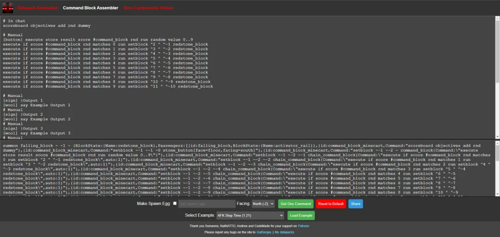
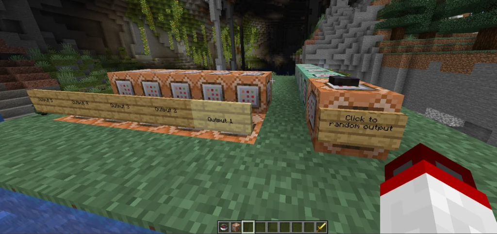

# Command Block Assembler

A powerful tool to generate "One Command Creation" commands for Minecraft.



## Overview

There are 4 sections for executing commands:

1.  **Just a command**: Will execute the specified command as is once at startup. Convenient to use to give the player an example item, for example.
2.  **Setup**: Will insert the specified commands into a chain of commands that will be executed only once. Convenient to use for initialization, such as creating scoreboards, teams, etc.
3.  **Controller**: The specified commands will create a chain of command blocks that will be executed every tick.
4.  **Manual**: First command block will be impulse and require redstone.

All commands by default will be executed as "Just a command". So you can start the commands by giving the player some example items.

## Usage

To switch to another section, you need to enter a line with the corresponding comment.

*   `# In chat`: All commands below will be executed as **Just command** - without creating command blocks.
*   `# Setup`: All commands below will be executed as **Setup**.
*   `# Controller` / `# Command block`: All commands below will be executed every tick (**Controller**).
*   `# Manual`: The commands will always be executed with the **Manual** mode.

Comment lines are also supported (lines starting with `#` but not matching the keywords above) and will be ignored when assembling commands.

### Multiple Sections

You can have several Setup / Controller sections. In this case, this will create a new chain of commands nearby. Empty lines between sections will increase the distance between command chains.

Example creating two command blocks 2 blocks apart:

```mcfunction
# Setup
say Hello


# Setup
say World
```

### Command Block Configuration

By default, the first command block in the section will be impulse (Setup) or repeating (Controller), and all command blocks below will be a chain. In this case, all command blocks are unconditional and always active.

You can configure this by specifying modifiers at the beginning of the command line:

*   `[RUA]` - **R**epeating, **U**nconditional, **A**lways active.
*   `[CCA]` - **C**hain, **C**onditional, **A**lways active.
*   `[IUN]` - **I**mpulse, **U**nconditional, **N**eeds redstone.

Any combination is supported.

### Direction

You can also select the direction in which the chains of command blocks will be directed on the site. For very long commands, it is recommended to use the direction to the north, since this will create the shortest command.

### Special Modifiers

*   **`[sign]`**: The line will be processed as text for a sign. You can set any type of sign, e.g., `[bamboo_sign]`. To go to a new line, use `|`.
*   **`[button]`** / **`[lever]`**: Must be on the same line as the command. Supports all button types. Using these modifiers will automatically set the command block as requiring redstone (even in Controller sections).
*   **`[wool]`** (subject to change): Prepares a place before the first command block to place a redstone block to activate the command chain. When activated, this replaces the redstone block with wool. Any color wool can be used. Automatically makes the command block require redstone.

## Examples



### Complex Example

```mcfunction
# In chat
## Create rnd scoreboard
scoreboard objectives add rnd dummy

## Random button
# Manual
[sign] Click to | random output
[polished_blackstone_button] execute store result score #command_block rnd run random value 1..5
execute if score #command_block rnd matches 1 run setblock ^2 ^ ^-1 redstone_block
execute if score #command_block rnd matches 2 run setblock ^3 ^ ^-2 redstone_block
execute if score #command_block rnd matches 3 run setblock ^4 ^ ^-3 redstone_block
execute if score #command_block rnd matches 4 run setblock ^5 ^ ^-4 redstone_block
execute if score #command_block rnd matches 5 run setblock ^6 ^ ^-5 redstone_block

## Outputs
# Manual
[birch_sign] ||Output 1
[red_wool] say Example Output 1
# Manual
[sign] |Output 2
[yellow_wool] say Example Output 2
# Manual
[sign] |Output 3
[brown_wool] say Example Output 3
# Manual
[sign] |Output 4
[blue_wool] say Example Output 4
# Manual
[sign] |Output 5
[gray_wool] say Example Output 5
```

### Multi-Controller Example

```mcfunction
# Example item
give @s stick
give @s apple

# Setup 1
say Setup 1
say Setup 2
say Setup 3

# Setup 2
say Setup 1
say Setup 2
say Setup 3

# Controller
[RUN] say Tick 1
say Tick 2
say Tick 3

# Controller
[RUN] say Tick 1
say Tick 2
say Tick 3

# Controller
[RUN] say Tick 1
say Tick 2
say Tick 3
```

> **Note**: You may notice `@s` used for `/give`. The site automatically corrects this to `@p` if `@s` is the target selector, giving the item to the player without creating a command block.

## Local Development

1.  Run `npm install`.
2.  Run `npm start` (or `node server.js`).
3.  Open `http://localhost:3000/main.html`.

## Support

Please report any bugs on the site to **GalSergey**.
